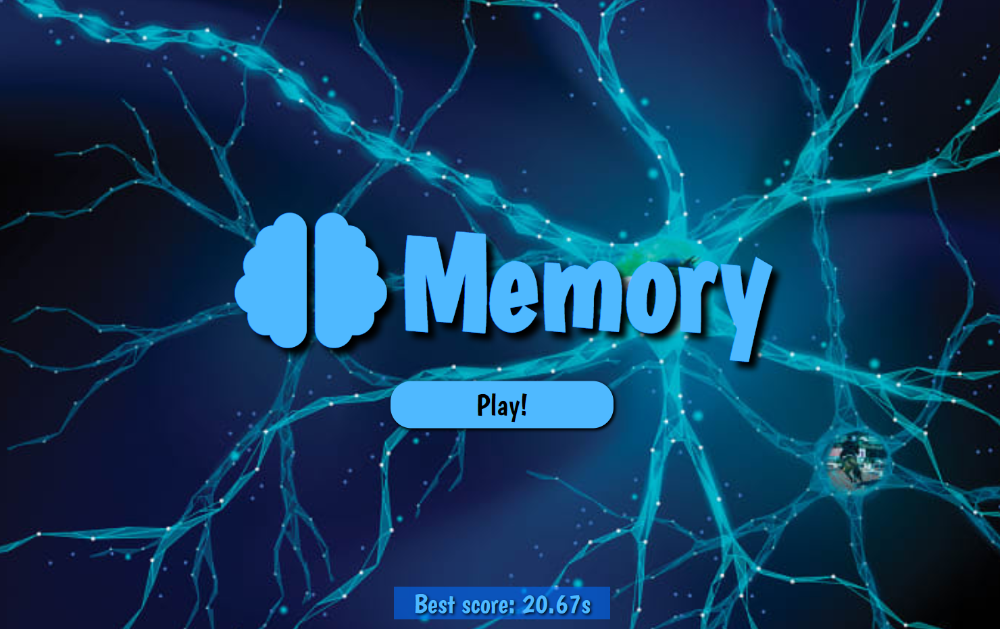

# Memory



 [Click and check it!](https://maciejspalek.github.io/Memory/)

## About the project 
A game of remembering pictures and matching them in pairs as quickly as possible. To comparing pictures has been implemented a simple algorithm. LocalStorage is responsible for remembering the best score.

## The project created with 
 * HTML
 * BEM
 * CSS + SASS
 * JS + jQuery
 * Responsive Web Design
 * Local Storage


## Usage

```
npm start
```